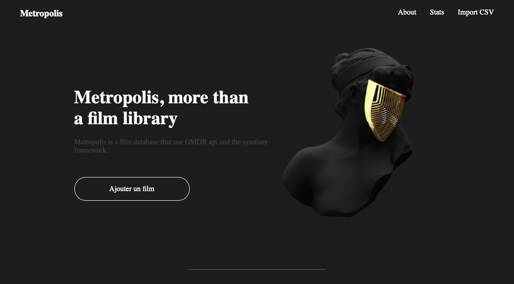
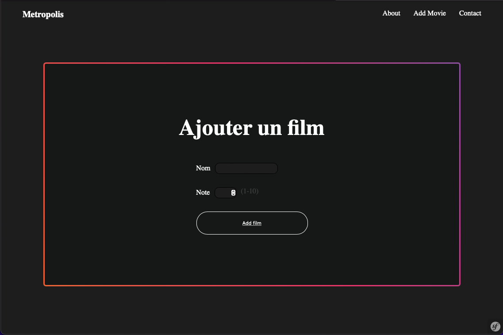
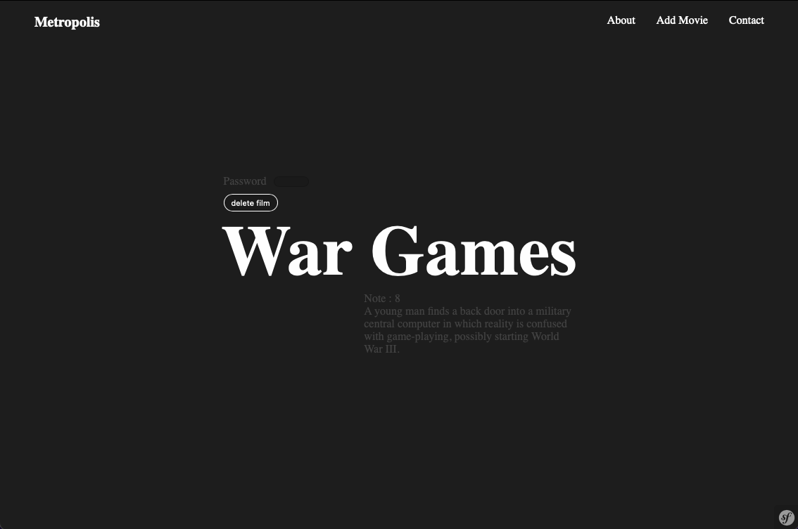

## About     

School project that can {display, add, remove} films.   
It's also using IMDBApi in order to fill the description field.  


## Usage 

Password to delete films is `1234`.  


## Installation   

__installation :__
```
> composer install
> npm install 
```

__usage :__   
```` 
> symfony server:start -d 
> npm run dev  # or npm run watch 
````

> .env is in dev btw... 

## Presentation 

<details>
<summary>Website pictures</summary>
<br>

- Homepage 
  
<br>

- Form   
   
<br>


- Film description   
  
<br>
</details>

 

 

<details open>
<summary>Technologies</summary>
<br>


<br>


<br>


</details>


