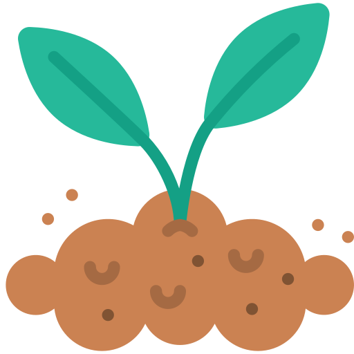

<h3 align="center">
	
</h3>

<h2 align="center">Vincent-vst</h2>

    
    
    

## 💡 About

Vincent-vst.github.io is where I store some of my webdesign experimentation.   
Here's a list of **some** website I made during the past few years :  
- [MajorOak](https://vincent-vst.github.io/MajorOak) : A bird/plant recognition website    
- [SnakeByte](https://vincent-vst.github.io/SnakeByte) : A game of snake   
- [Portfolio](https://vincent-vst.github.io/Portfolio) : My old three.js portfolio website (the new one is : vincent-vst.fr)   
- [Metropolis](https://vincent-vst.github.io/Metropolis) : A film library 
- [Greenhouse](https://vincent-vst.github.io/Greenhouse) : A monitoring system for my greenhouse  

## 🧠 Philosophy

Some websites probably don't work anymore, [vincent-vst](https://vincent-vst.github.io) is my sandbox and I'm not really debugging it.   
But if for some reasons, you want to submit an issue/pull request, you can do that [here](https://github.com/Vincent-vst/Vincent-vst.github.io).  

## 🧾 License 

Most of those websites are under an MIT or GNU license.  

## 🚥 Roadmap  

- [x] : Greenhouse dashboard
- [ ] : Greenhouse API 
- [ ] : Skyblog thingy 
- [ ] : Wikipedia css 