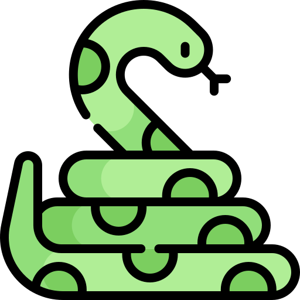
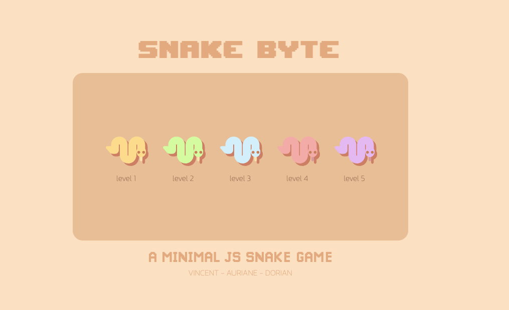

# SnakeByte   

SnakeByte is a minimal snake game written in JS.   

## 🚏 Roadmap       

- [x] : faire un écran d'acceuil pour choisir les niveaux
- [x] : faire le changement de pages en changant de DOM pas en rechargant la page 
- [x] : décrire les niveaux en JSON 
- [x] : ajouter des sons 
- [x] : ajouter un écran de game over 

## 📚 Author   

[vincent](https://www.github.com/Vincent-vst)   

## ✨ Overview      

    
Screenshots of the game : 

     
    

